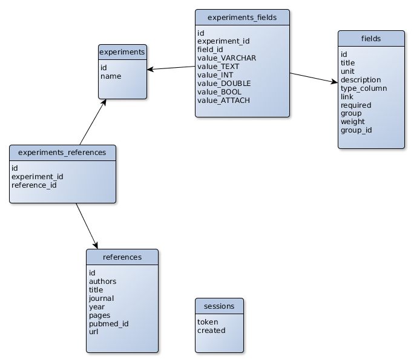

## CAMEL

Compendium of Adaptive Microbial Experiments in the Lab

This database is part of the following review:  
Bram Van den Bergh,
Toon Swings, Maarten Fauvart & Jan Michiels (2018) Experimental
design, population dynamics and diversity in microbial experimental
evolution. [Microbiology and Molecular Biology Reviews][MMBR] (MMBR).

[MMBR]: http://mmbr.asm.org/


This project aims to be an updated, interactive version of:  
https://www.biw.kuleuven.be/comp2/camel/

## Application outline
### Database
MySQL

Schema:



The `import_data.py` script starts from the original CAMEL data (xlsx
-> csv), but makes a lot of assumptions about existing fields and
species, so is at the moment NOT suitable as bulk upload script.


### Backend

Python3 Flask Restful API

Dependencies:

- flask
- flask_restful
- MySQLdb

Apache webserver needs to have the the `mod_wsgi` module installed for
Python3 with a `ScriptAlias` pointing at the entry point `camel.wsgi`

For data attachments, CAMEL will need a directory on the webserver
that is read/writable for Apache and can be publicly served, either as
a CAMEL subfolder, or in its own DocumentRoot. On systems with SELinux
enabled, also make sure that this folder has the context
`httpd_sys_rw_content_t` and the sebool is set to
`allow_httpd_sys_script_anon_write`. Besides, SELinux will only allow CAMEL
to do PubMed lookups if it has `httpd_can_network_connect` permissions too.

### Configuration

Backend configuration: `camel.conf.default`  
Copy to `camel.conf` and add database credentials and upload paths.

Frontend configuration: `public/app/app.config.default.js`  
Copy to `public/app/app.config.js` and set API and download URLs.

#### API Calls
All data can be retrieved with simple `get` requests.  
`post`, `put` and `delete` require an `AuthToken` in the headers, as explained below.

Get all experiment data, or one specific experiment.
```
https://dev.bits.vib.be/CAMEL/api/experiment
https://dev.bits.vib.be/CAMEL/api/experiment/<id>
```

The returned JSON is a list of experiments, each with their
attributes, a list of references and a list of fields, indexed by field_id.

The experiment list can be filtered by adding one or more parameters.
```
https://dev.bits.vib.be/CAMEL/api/experiment?<field_id>=<filter>
```
Text fields get searched for the literal string. Numeric fields use a minimum and maximum value instead.

eg. get all experiments where the species contains "phage" and the number of lines is between 12 and 20:
```
https://dev.bits.vib.be/CAMEL/api/experiment?1=phage&min_3=12&max_3=20
```

Get all field data:
```
https://dev.bits.vib.be/CAMEL/api/field
```

Get data for one specific field. Id can be both the field_id or the field title.
```
https://dev.bits.vib.be/CAMEL/api/field/<id>
```

Next to the field properties, the JSON also contains a `values`
attribute, with a list of the values this field contains in the
database, ordered by descending number of occurrences.  This feature
gets extended by adding the `timeline` flag. The values will then be
ordered by year, with the number of occurrences that year.

```
https://dev.bits.vib.be/CAMEL/api/field/<id>?timeline=1
```

A simple list of all references (papers):
```
https://dev.bits.vib.be/CAMEL/api/reference
```


To edit the existing content and post new experiments and fields, the
API also supports POST, PUT and DELETE requests. These require more
scripting. A demo with Python requests can be found here:  
[Python edit API demo](admin/import_example.py)


## Authentication

Authentication is done by a separate Flask application.  Visiting the
page served by this app, will return a response containing a
`AuthToken` header. This token is also written to the database. The
page can be secured by setting authentication rules in the `.htaccess`
(Basic Auth, Shiboleth, ...).

The AngularJS application should be including the token in the `AuthToken`
header with every request that should be authenticated by the
API. Tokens get removed from the database after one day, expiring the
session.


### Frontend

AngularJS application with dependencies on Bootstrap MD, JQuery and
eCharts.

Apache should use `public` as the DocumentRoot for this application.  
`camel.conf.default` should be copied to `camel.conf` in the same folder, with correct 
database credentials.

#### Versions and API's
 * AngularJS 1.7.6  
   https://code.angularjs.org/1.7.6/docs/guide
 * JQuery 3.3.1  
   https://api.jquery.com/
 * JQuery UI 1.12.1 (Custom)  
   https://api.jqueryui.com/
 * Popper.js 1.15  
   https://popper.js.org/
 * Bootstrap Material Design 4.0.0  
   https://fezvrasta.github.io/bootstrap-material-design/docs/4.0/getting-started/introduction/
 * eCharts 4.2.1  
   https://echarts.apache.org/en/api.html#echarts

## Hosting
The development version can be viewed at
https://dev.bits.vib.be/CAMEL/
